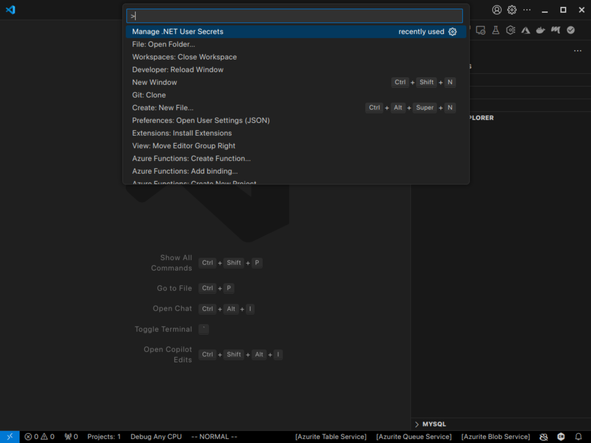

# UserSecret README

Manage user secrets: a VS Code extension to manage .NET user secrets file.
## Usage

## Features

- Easily manage .NET user secrets within VS Code.
- Add, remove, and update secrets without leaving the editor.

## PreRelease Notes

- Initial release of UserSecret.