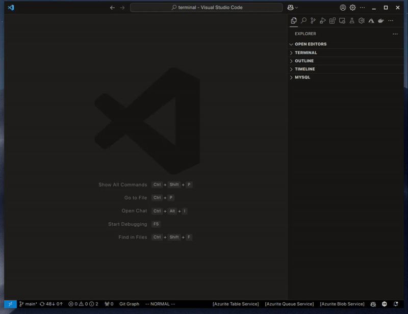
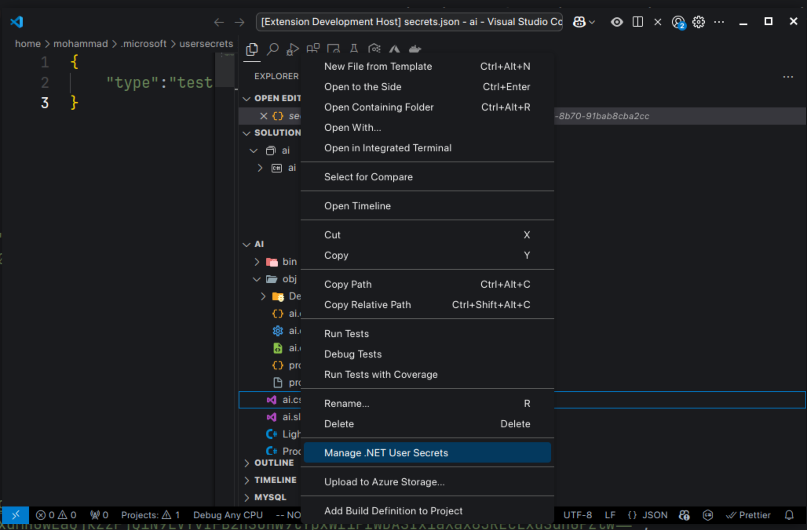

# Asrar

Asrar: a VS Code extension to manage .NET user secrets file.
## Usage

## Features

- Easily manage .NET user secrets within VS Code.
- Add, remove, and update secrets without leaving the editor.

## Release Notes
- Move the context menu command to `Command Group` instead of `Navigation Group`.
- Make the last selected `Csproj` file as the first entry in the file selection list.